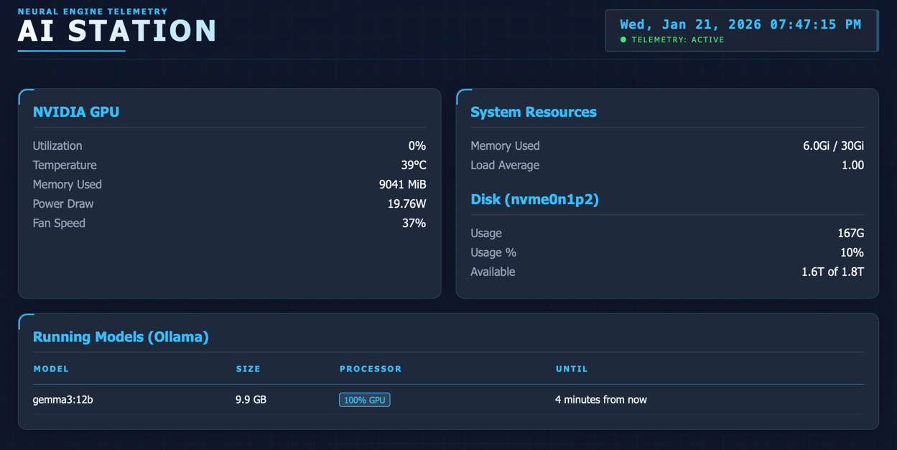

# 🖥️ AI Station Monitor

A lightweight, real-time web dashboard built with **Flask** and **Docker** to monitor NVIDIA GPU performance, system resources, and running **Ollama** models.


## 🚀 Features
* **GPU Monitoring:** Real-time tracking of Fan Speed, Temperature, Power Draw, and VRAM usage via `nvidia-smi`.
* **Ollama Integration:** Structured view of currently loaded AI models, including size and processor (CPU/GPU) type.
* **System Vitals:** Live updates of CPU Load Average, RAM usage, and Disk health (`nvme0n1p2`).
* **Auto-Refresh:** Uses JavaScript `fetch` to update stats every 5 seconds without page flickering.
* **Containerized:** Fully Dockerized with GPU passthrough and Docker-socket access.


---

## 🛠️ Installation & Setup

### 1. Prerequisites
Ensure your Ubuntu host has the following installed:
* [Docker & Docker Compose](https://docs.docker.com/engine/install/ubuntu/)
* [NVIDIA Container Toolkit](https://docs.nvidia.com/datacenter/cloud-native/container-toolkit/latest/install-guide.html) (Required for GPU passthrough)

### 2. Clone the Repository
```bash
git clone git@github.com:YOUR_USERNAME/ai-station-monitor.git
cd ai-station-monitor

```

### 3. Launch the Dashboard

Use Docker Compose to build and run the app in the background:

```bash
docker compose up -d

```

The dashboard will be available at: `http://aistation.local:5000` or `http://<your-ip>:5000`.

---

## 📂 Project Structure

* `app.py`: The Flask backend that parses system commands into JSON.
* `templates/monitor.html`: The frontend UI with CSS Grid and JavaScript auto-refresh logic.
* `docker-compose.yml`: Handles GPU reservations and mounts the host Docker socket.
* `Dockerfile`: Builds the Python environment and installs the Docker CLI.

---

## 🔧 Configuration & Permissions

### Docker Socket Access

To allow the dashboard to see your **Ollama** container status, the container needs permission to read the host's Docker socket:

```bash
sudo chmod 666 /var/run/docker.sock

```

### Firewall Setup

If you cannot reach the dashboard from another device, ensure port 5000 is open:

```bash
sudo ufw allow 5000/tcp

```

---

## 👨‍💻 Development

This project uses **Docker Volumes**. Any changes you make to `app.py` or the HTML template will reflect immediately inside the running container without needing a rebuild.

To view live logs for debugging:

```bash
docker compose logs -f

```

## 📝 License

MIT License - Feel free to use and modify!


